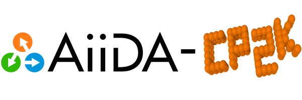

# AiiDA CP2K
**The CP2K plugin for the AiiDA workflow and provenance engine.**




# Installation

If you use `pip`, you can install it as: 
```
pip install aiida-cp2k
```


# Features
Following the philosophy to _''enable without getting in the way''_, this plugin provides access to all of CP2K's capabilities through a small set of well-tested features:

- A full [CP2K input](https://manual.cp2k.org) has to be provided as a nested Python dictionary ([example](./test/test_dft.py)):
```
params = {'FORCE_EVAL': {'METHOD': 'Quickstep', 'DFT': { ... }}}
calc.use_parameters(ParameterData(dict=params))
```

- Section parameters are stored as key `_` in the dictionary:
```
xc_section = {'XC_FUNCTIONAL': {'_': 'LDA'}}
```

- Repeated sections are stored as a list:
```
kind_section = [{'_': 'H', 'BASIS_SET': 'DZVP-MOLOPT-GTH', 'POTENTIAL': 'GTH-LDA'},
                {'_': 'O', 'BASIS_SET': 'DZVP-MOLOPT-GTH', 'POTENTIAL': 'GTH-LDA'}]
```

- Most data files (basis sets, pseudo potentials, VdW, etc.) are auto-discovered from CP2K's [data directory](https://github.com/cp2k/cp2k/tree/master/cp2k/data).
```
dft_section = {'BASIS_SET_FILE_NAME': 'BASIS_MOLOPT', ...}
```

- Additional data files can be added as AiiDA SinglefileData ([example](test/test_mm.py)):
```
water_pot = SinglefileData(file="/tmp/water.pot")
calc.use_file(water_pot, linkname="water_pot")
```

- The start geometry can be provided as AiiDA StructureData ([example](./test/test_dft.py)):
```
atoms = ase.build.molecule('H2O', vacuum=2.0)
calc.use_structure(StructureData(ase=atoms))
```

- Alternatively the start geometry can be contained in the CP2K input ([example](./test/test_no_struct.py)):
```
coord_section = {' ': ['H    2.0   2.0   2.737166',
                       'H    2.0   2.0   2.000000']},
```

- For restarting a calculation a parent folder can be attached  ([example](./test/test_restart.py)):
```
calc2.use_parent_folder(calc1.out.remote_folder)
```

- By default only the output and restart file (if present) are retrieved. Additional files are retrieved upon request ([example](test/test_mm.py)):
```
settings = {'additional_retrieve_list': ["*.cube"]}
calc.use_settings(ParameterData(dict=settings))
```

- The final geometry is extracted from the restart file (if present) and stored in AiiDA ([example](./test/test_geopt.py)):
```
print(calc.out.output_structure)
```

- From the CP2K output only the #warnings and final energy are parsed ([example](./test/test_mm.py)):
```
print(calc.res.nwarnings, calc.res.energy, calc.res.energy_units)
```

- The calculation is considered failed if #warnings can not be found ([example](./test/test_failure.py)).

- The conversion of geometries between AiiDA and CP2K has a precision of at least 1e-10 Ångström ([example](./test/test_precision.py)).

- The Python code complies with the [Flake8](http://flake8.pycqa.org) coding conventions.


# Testing

Every commit and pull request is automatically tested by [TravisCI](https://travis-ci.org/cp2k/aiida-cp2k/).

To run the tests locally install [Docker](https://docs.docker.com/engine/installation/) and execute the following commands:
```
git clone https://github.com/cp2k/aiida-cp2k
docker build -t aiida_cp2k_test aiida-cp2k
docker run -it --init aiida_cp2k_test
```
